# Benchmark Report — Rust SDK vs Python SDK

Results captured from `.work/`. Nothing was rerun to produce this report.

See [README.md](./README.md) if you don't know what the pipeline or the four
phases are — this file just reports numbers.

## The one-line answer

At 10,000+ input files:

- **Rust SDK cold run is 30–80× faster** than the Python SDK, depending on
  profile.
- **Rust SDK warm run is 8–10× faster**.
- **Incremental edits stay small in both** — the incremental contract isn't
  the thing that separates them; raw per-call overhead is.

## Speedup at a glance — codebase / cold phase

```mermaid
xychart-beta
    title "Cold speedup (py_ms / rust_ms) — codebase scenario"
    x-axis ["tiny", "medium", "large", "xlarge"]
    y-axis "speedup (x)" 0 --> 90
    bar [2.22, 10.54, 16.89, 32.36]
    bar [5.75, 30.04, 52.71, 81.61]
    bar [3.13, 11.70, 13.16, 17.58]
```

Bars are `mixed`, `cpu`, `io` in that order. The `docs` scenario has the same
shape — bigger scale, bigger gap.

Peak wins (xlarge, cold phase):

| Scenario | Profile | Speedup     |
| -------- | ------- | ----------: |
| codebase | cpu     | **81.61×**  |
| docs     | cpu     | **73.69×**  |
| codebase | mixed   | 32.36×      |
| docs     | mixed   | 30.04×      |
| docs     | io      | 23.42×      |
| codebase | io      | 17.58×      |

## Did the incremental contract hold?

Yes, at every scale:

- `warm` phases had `cache_misses = 0` (every section hit the memo cache).
- `shape` phases invalidated only **9–15 sections** and rewrote only **4–11
  output files**, at every scale from tiny to xlarge. Adding/renaming one
  file doesn't cascade into a near-full rebuild.

## Where the numbers come from (the matrix)

| Axis      | Values                                                   |
| --------- | -------------------------------------------------------- |
| scales    | `tiny`, `medium`, `large`, `xlarge`                      |
| scenarios | `codebase`, `docs`                                       |
| profiles  | `io`, `cpu`, `mixed`                                     |
| phases    | `cold`, `warm`, `edit`, `shape`                          |

### Input dataset sizes

Raw file counts generated by `common.py`. `mixed` and `cpu` share the same
counts; `io` doubles the fanout.

| Scale  | all mixed/cpu | all io | codebase mixed/cpu | codebase io | docs mixed/cpu | docs io |
| ------ | ------------: | -----: | -----------------: | ----------: | -------------: | ------: |
| tiny   |            51 |    102 |                 27 |          54 |             24 |      48 |
| medium |           368 |    736 |                176 |         352 |            192 |     384 |
| large  |          1280 |   2560 |                704 |        1408 |            576 |    1152 |
| xlarge |         10752 |  21504 |               5632 |       11264 |           5120 |   10240 |

## Full per-phase tables

Each cell is `rust_ms / py_ms / ratio`. Medians across trials. Bigger ratio
is a bigger Rust win.

### Tiny — noisy, treat as smoke test

| Scenario | Profile | Cold                  | Warm                 | Edit                  | Shape                |
| -------- | ------- | --------------------- | -------------------- | --------------------- | -------------------- |
| codebase | io      | 68.7 / 215.4 / 3.13x  | 47.2 / 99.7 / 2.11x  | 45.0 / 106.5 / 2.37x  | 77.6 / 142.1 / 1.83x |
| codebase | cpu     | 58.0 / 333.7 / 5.75x  | 40.7 / 54.8 / 1.34x  | 41.8 / 62.8 / 1.50x   | 67.2 / 84.0 / 1.25x  |
| codebase | mixed   | 46.2 / 102.5 / 2.22x  | 40.7 / 50.9 / 1.25x  | 44.3 / 55.1 / 1.24x   | 70.4 / 57.9 / 0.82x  |
| docs     | io      | 55.0 / 217.3 / 3.95x  | 44.5 / 86.5 / 1.94x  | 45.2 / 148.7 / 3.29x  | 69.6 / 99.0 / 1.42x  |
| docs     | cpu     | 50.0 / 319.3 / 6.38x  | 42.2 / 52.7 / 1.25x  | 43.4 / 60.1 / 1.38x   | 66.0 / 73.8 / 1.12x  |
| docs     | mixed   | 46.0 / 91.6 / 1.99x   | 41.9 / 50.7 / 1.21x  | 42.5 / 54.0 / 1.27x   | 68.4 / 55.6 / 0.81x  |

At tiny, fixed overhead (process start, LMDB open) dominates. The one row
where Python looks faster is `shape / mixed` — expected at this scale.

### Medium — first scale where the gap is consistent

| Scenario | Profile | Cold                     | Warm                   | Edit                   | Shape                  |
| -------- | ------- | ------------------------ | ---------------------- | ---------------------- | ---------------------- |
| codebase | io      | 123.8 / 1448.0 / 11.70x  | 76.7 / 504.0 / 6.57x   | 83.8 / 519.4 / 6.20x   | 104.7 / 502.0 / 4.79x  |
| codebase | cpu     | 81.0 / 2435.1 / 30.04x   | 50.8 / 219.6 / 4.32x   | 50.9 / 261.4 / 5.13x   | 74.0 / 241.5 / 3.26x   |
| codebase | mixed   | 54.1 / 569.7 / 10.54x    | 50.1 / 191.8 / 3.83x   | 55.2 / 209.0 / 3.79x   | 71.8 / 206.1 / 2.87x   |
| docs     | io      | 125.1 / 1754.9 / 14.03x  | 70.5 / 528.2 / 7.49x   | 74.9 / 550.6 / 7.35x   | 109.3 / 532.9 / 4.88x  |
| docs     | cpu     | 85.1 / 2995.8 / 35.18x   | 51.9 / 233.4 / 4.49x   | 53.2 / 248.4 / 4.67x   | 76.1 / 259.5 / 3.41x   |
| docs     | mixed   | 59.1 / 686.7 / 11.62x    | 48.8 / 209.4 / 4.29x   | 48.9 / 219.4 / 4.49x   | 79.0 / 213.7 / 2.70x   |

### Large — full matrix separates cleanly

| Scenario | Profile | Cold                      | Warm                    | Edit                    | Shape                   |
| -------- | ------- | ------------------------- | ----------------------- | ----------------------- | ----------------------- |
| codebase | io      | 435.4 / 5730.3 / 13.16x   | 197.7 / 1878.2 / 9.50x  | 308.8 / 1925.4 / 6.24x  | 318.1 / 1885.5 / 5.93x  |
| codebase | cpu     | 193.0 / 10173.7 / 52.71x  | 129.1 / 798.4 / 6.18x   | 142.7 / 837.1 / 5.87x   | 165.6 / 871.6 / 5.26x   |
| codebase | mixed   | 127.9 / 2161.2 / 16.89x   | 117.7 / 674.8 / 5.74x   | 129.3 / 702.9 / 5.44x   | 137.7 / 693.8 / 5.04x   |
| docs     | io      | 305.5 / 6109.2 / 20.00x   | 159.5 / 1727.5 / 10.83x | 221.2 / 1718.6 / 7.77x  | 195.3 / 1708.5 / 8.75x  |
| docs     | cpu     | 189.3 / 11076.1 / 58.50x  | 108.9 / 1164.0 / 10.69x | 82.2 / 934.1 / 11.37x   | 110.9 / 990.8 / 8.93x   |
| docs     | mixed   | 127.6 / 2438.3 / 19.11x   | 98.4 / 653.8 / 6.64x    | 95.7 / 802.9 / 8.39x    | 116.0 / 723.2 / 6.24x   |

### XLarge — the headline run (10k+ files)

| Scenario | Profile | Cold                        | Warm                     | Edit                      | Shape                    |
| -------- | ------- | --------------------------- | ------------------------ | ------------------------- | ------------------------ |
| codebase | io      | 3566.3 / 62710.1 / 17.58x   | 2111.0 / 19738.8 / 9.35x | 1624.9 / 17727.2 / 10.91x | 2070.2 / 15623.2 / 7.55x |
| codebase | cpu     | 1099.3 / 89710.7 / 81.61x   | 670.4 / 6798.1 / 10.14x  | 669.9 / 6912.0 / 10.32x   | 679.2 / 7081.1 / 10.42x  |
| codebase | mixed   | 579.9 / 18764.9 / 32.36x    | 567.6 / 5843.3 / 10.29x  | 667.4 / 5843.7 / 8.76x    | 642.1 / 5788.8 / 9.02x   |
| docs     | io      | 2498.9 / 58518.0 / 23.42x   | 1781.3 / 15456.5 / 8.68x | 1977.7 / 15362.5 / 7.77x  | 1981.5 / 15480.9 / 7.81x |
| docs     | cpu     | 1361.1 / 100299.5 / 73.69x  | 698.1 / 6749.0 / 9.67x   | 640.2 / 6433.4 / 10.05x   | 837.0 / 6495.4 / 7.76x   |
| docs     | mixed   | 678.1 / 20372.6 / 30.04x    | 662.1 / 5451.0 / 8.23x   | 675.9 / 5507.9 / 8.15x    | 604.1 / 5677.6 / 9.40x   |

## Shape-phase trend

Shape is the mutation-heaviest phase. Tracking the ratio across scales
shows the Rust advantage compounds as the dataset grows:

### Codebase

| Profile | tiny  | medium | large | xlarge |
| ------- | ----: | -----: | ----: | -----: |
| io      | 1.30x | 4.79x  | 5.93x | 7.55x  |
| cpu     | 1.24x | 3.08x  | 5.26x | 10.42x |
| mixed   | 0.85x | 2.54x  | 5.04x | 9.02x  |

### Docs

| Profile | tiny  | medium | large | xlarge |
| ------- | ----: | -----: | ----: | -----: |
| io      | 1.27x | 5.01x  | 8.75x | 7.81x  |
| cpu     | 1.15x | 3.58x  | 8.93x | 7.76x  |
| mixed   | 0.83x | 2.68x  | 6.24x | 9.40x  |

## How to read these numbers

- **Cold** is the raw build-from-scratch cost. Big ratios here = Rust handles
  the fanout and per-section work more efficiently.
- **Warm** is the cached-everything rerun. Python still pays more per
  cache-hit than Rust does, so the gap is still there — just narrower than
  cold.
- **Edit / Shape** prove the incremental contract: cache misses and rebuilt
  outputs stay small and bounded. A regression here would show up as a
  near-cold-sized wall time.

## When to use which scale

| Scale    | Use for                                   |
| -------- | ----------------------------------------- |
| `tiny`   | CI smoke test only — fixed overhead noise |
| `medium` | first scale where numbers are meaningful  |
| `large`  | full-matrix production runs               |
| `xlarge` | headline / press-release numbers          |

## Footnote: artifact caveat

`runner.py` overwrites `rust_metrics.json` and `python_metrics.json` on every
phase. That means the on-disk JSON for any given trial only keeps the final
(`shape`) phase. The per-phase tables above come from what was captured
in-memory during the runs that produced this report; they are reproducible,
just not all present as files.

If you need per-phase persistence, pipe the runner output with `--format
json` into your own store instead.
