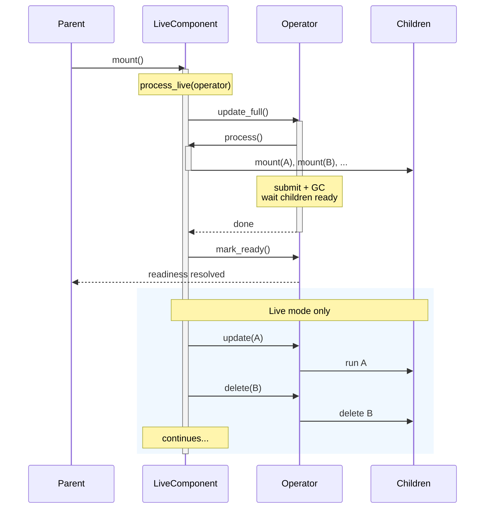

# Live Components

By default, a processing component runs a **full scan** each time — it declares all target states and mounts all sub-components from scratch. CocoIndex handles incremental updates by skipping memoized sub-components and reconciling target states at the end. This works well when the dataset is small enough to scan fully each cycle.

When the dataset is large or you need to react to changes continuously (e.g., watching a file system), you want the component itself to be incremental. A **live component** does an initial full scan, then reacts to individual changes without rescanning everything.

## The LiveComponent protocol

A live component is a class with three methods:

```python
class MyLiveComponent:
    def __init__(self, folder: pathlib.Path, target: localfs.DirTarget) -> None:
        """Receive arguments from the mount() call."""
        self.folder = folder
        self.target = target

    async def process(self) -> None:
        """Full processing — mount all children, declare all target states."""
        ...

    async def process_live(self, operator: coco.LiveComponentOperator) -> None:
        """Continuous processing — orchestrate full and incremental updates."""
        ...
```

- **`__init__`** receives arguments passed to `coco.mount()`.
- **`process()`** does a full scan — mounts children via `coco.mount()` and declares target states, just like a traditional component function. Called indirectly via `operator.update_full()`.
- **`process_live(operator)`** is the long-running entry point. It orchestrates full and incremental updates using the operator.

CocoIndex detects a live component by checking if the class has both `process` and `process_live` methods.

## LiveComponentOperator

The `operator` passed to `process_live()` provides four methods:

| Method | Description |
|--------|-------------|
| `await operator.update_full()` | Run `process()` with a full submission phase (GCs removed children). Blocks until fully ready. |
| `await operator.update(subpath, fn, *args, **kwargs)` | Mount a child component incrementally. |
| `await operator.delete(subpath)` | Delete a child component. |
| `await operator.mark_ready()` | Signal that processing has caught up to the time `process_live()` was called. |

### `update_full()`

Triggers a full processing cycle: calls `process()`, submits target states, waits for all children to be ready, and garbage-collects children that are no longer mounted. This is the same mechanism as a traditional component's update cycle.

### `update()` and `delete()`

Mount or delete individual child components without a full scan. These are concurrent with each other but serialized with `update_full()` — if `update_full()` is running, incremental operations wait until it finishes.

When multiple operations target the same subpath, only the latest one (by invocation order) takes effect.

### `mark_ready()`

Signals to the parent that the live component has caught up. The parent's `await handle.ready()` returns when `mark_ready()` is called. If `process_live()` returns without calling `mark_ready()`, it is called automatically.

## Example: file system watcher

A component that watches a local folder and processes each file:

```python
import pathlib
import cocoindex as coco

class FolderWatcher:
    def __init__(self, folder: pathlib.Path, target) -> None:
        self.folder = folder
        self.target = target

    async def process(self) -> None:
        """Full scan — mount a child for every file in the folder."""
        for path in self.folder.iterdir():
            if path.is_file():
                await coco.mount(
                    coco.component_subpath(path.name),
                    process_file,
                    path,
                    self.target,
                )

    async def process_live(self, operator: coco.LiveComponentOperator) -> None:
        # 1. Set up the file watcher before the full scan so no events are missed.
        watcher = setup_watchdog(self.folder)

        # 2. Full scan.
        await operator.update_full()

        # 3. Signal readiness — parent can proceed.
        await operator.mark_ready()

        # 4. React to changes.
        async for event in watcher.events():
            subpath = coco.component_subpath(event.filename)
            if event.is_update:
                await operator.update(subpath, process_file, event.path, self.target)
            elif event.is_delete:
                await operator.delete(subpath)
```

The parent mounts it like any other component:

```python
@coco.fn
async def app_main(folder: pathlib.Path, outdir: pathlib.Path) -> None:
    # Set up the target in the parent (use_mount is not allowed inside process()).
    target = await coco.use_mount(
        coco.component_subpath("setup"),
        localfs.declare_dir_target,
        outdir,
    )
    # Mount the live component.
    await coco.mount(coco.component_subpath("watch"), FolderWatcher, folder, target)
```

## Example: traditional component equivalent

A traditional single-function component:

```python
@coco.fn
async def process_all(data) -> None:
    for key, value in data.items():
        coco.declare_target_state(target.target_state(key, value))
```

is equivalent to this LiveComponent:

```python
class ProcessAll:
    def __init__(self, data):
        self.data = data

    async def process(self) -> None:
        for key, value in self.data.items():
            coco.declare_target_state(target.target_state(key, value))

    async def process_live(self, operator: coco.LiveComponentOperator) -> None:
        await operator.update_full()
        # mark_ready() is called automatically on return.
```

The key difference: the LiveComponent version can later be extended to handle incremental changes in `process_live()` without changing `process()`.

## Live mode

Live mode controls whether `process_live()` continues running after `mark_ready()`.

### Enabling live mode

```python
# Programmatic
app.update_blocking(live=True)

# Or async
handle = app.update(live=True)
await handle.result()
```

```bash
# CLI
cocoindex update --live my_app.py
# or
cocoindex update -L my_app.py
```

### Propagation

- `coco.mount()` and `operator.update()` inherit `live` from the parent.
- `coco.use_mount()` always sets children as non-live.

### Non-live mode behavior

When `live=False` (the default), `process_live()` is still called, but it terminates as soon as `mark_ready()` is awaited. No code after `await operator.mark_ready()` executes. This means a live component in non-live mode behaves like a traditional component: it does a full update, signals ready, and stops.

This design lets you use the same LiveComponent class in both modes without code changes.

## Restrictions

### No `use_mount()` inside `process()`

`process()` may only call `coco.mount()` (background child mounts). Any setup that requires `use_mount()` — such as declaring target tables — must be done in the **parent** component before mounting the LiveComponent. This keeps the controller's provider set stable across full and incremental updates.

### Not allowed in `use_mount()` or `mount_each()`

LiveComponent classes can only be used with `coco.mount()` and `operator.update()`. Passing a LiveComponent class to `coco.use_mount()` or `coco.mount_each()` raises a `TypeError`.

## Readiness

The parent's `await handle.ready()` returns when `mark_ready()` is called inside `process_live()`, regardless of whether `process_live()` is still running.



If `process_live()` returns without calling `mark_ready()`, it is called automatically — the parent will not hang.
