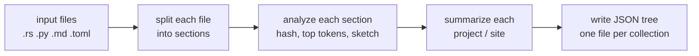
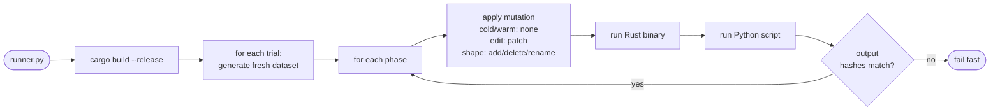

# Rust SDK vs Python SDK — side-by-side benchmark

## TL;DR

The same pipeline is written twice — once with the CocoIndex Rust SDK, once
with the Python SDK — and both are run against the same input files under the
same rules. Wall-clock times get compared, and the outputs must match byte for
byte.

The headline result: **at 10k files, the Rust SDK's cold run is 30–80× faster
than the Python SDK** (see [BENCHMARK_REPORT.md](./BENCHMARK_REPORT.md)). Warm
reruns are ~10× faster. Incremental edits stay small in both.

## What does the pipeline actually do?

It's a realistic "turn a bunch of files into JSON summaries" workload:



Every step uses a CocoIndex primitive:

- **Split each file into sections** → `#[function(memo)]` — skipped on rerun
  if the file didn't change.
- **Analyze each section** → `#[function(memo, batching)]` — cache hits
  return instantly; cache misses are collected into one batch call (this is
  the same shape as a real LLM pipeline).
- **Summarize each collection** → `#[function(memo)]` — skipped if none of
  its sections changed.
- **Write JSON tree** → diff-aware writer: only rewrites files whose contents
  actually changed.

That's it. Same pipeline, different language.

## What do "memo" and "batching" actually mean?

Two words that come up a lot:

- **memo** = "if this function has already been called with these exact
  inputs, return the cached output and skip running it."
- **batching** = "instead of N separate calls, wait for the misses, group
  them into one call to the expensive function, then hand the results back
  in order."

The benchmark exists to prove both of these work well in the Rust SDK, not
just the Python SDK.

## Why four phases?

A single cold run doesn't tell you much. Real CocoIndex users care about what
happens on the *second* run, and what happens after a small edit. So every
trial runs four phases back to back, each against the same state directory:


| Phase   | What changes              | What you expect to see                     |
| ------- | ------------------------- | ------------------------------------------ |
| `cold`  | nothing cached yet        | every section processed (all misses)       |
| `warm`  | same inputs, cache ready  | every section hits cache (work ≈ 0)        |
| `edit`  | small content changes     | only touched files re-process              |
| `shape` | files added/renamed/removed | only the affected collections re-process |

If `edit` or `shape` re-processed the whole dataset, the incremental contract
would be broken. The benchmark watches for that.

## A concrete tiny example

`--scenario codebase --scale tiny` generates 3 projects, ~9 files each. After
one full run you'd see something like:

```
dataset/
├─ project_000/
│  ├─ src/module_00.rs        (4 sections)
│  ├─ src/module_01.rs        (4 sections)
│  ├─ python/worker_00.py     (4 sections)
│  ├─ docs/guide_00.md        (3 sections)
│  └─ Cargo_00.toml           (2 sections)
├─ project_001/ ...
└─ project_002/ ...

output/
├─ projects/project_000.json   ← one JSON per project
├─ projects/project_001.json
├─ projects/project_002.json
└─ manifest.json               ← index of everything
```

Now walk through the phases for `project_000`:

- **cold** → all 17 sections go through `analyze_sections`. 1 batch call per
  project. All 4 output JSON files get written.
- **warm** → all 17 sections hit the cache. 0 batch calls. 0 output files
  rewritten.
- **edit** → `module_00.rs` gets a patch appended. Its 4 sections re-extract
  (their text changed), so 4 sections miss. 13 sections still hit. 1 output
  file rewritten (`project_000.json`). The other two projects are untouched.
- **shape** → one file deleted, one renamed, one new file added. The sections
  inside those files miss. Two output files change (the two affected
  projects). The third project is untouched.

That's the incremental contract the benchmark measures.

## How the runner glues it together



The two binaries each emit a `metrics.json` with timings and counters. The
runner diffs the output trees; if Rust and Python produce different bytes,
the run fails immediately. That invariant is what makes the timing numbers
trustworthy.

## Running it

```sh
# fastest smoke check — tiny dataset, one scenario
python3 runner.py --scenario codebase --profile mixed --scale tiny

# medium is where the real numbers start
python3 runner.py --scenario all --profile mixed --scale medium --trials 3

# full matrix (all scenarios × all profiles)
python3 runner.py --scenario all --profile all --scale large

# the 10k+ file matrix behind BENCHMARK_REPORT.md
python3 runner.py --scenario all --profile all --scale xlarge

# JSON output for piping into something else
python3 runner.py --scenario all --profile all --scale tiny --format json
```

`./run.sh` is just `exec python3 runner.py "$@"`, so the flags are identical.

Under the hood the runner will:

1. Build `benchmark_rust` in release mode.
2. Create `.work/<scenario>/<profile>/<scale>/trial_NN/` with fresh dataset,
   state, and output dirs.
3. For each of `cold / warm / edit / shape`: run Rust, run Python, compare
   the output trees' hashes.
4. Aggregate medians across trials and print a per-phase table.

## Scenarios, profiles, scales

Three dimensions you can tune independently:

| What it changes   | Values                                   | Knob                                                           |
| ----------------- | ---------------------------------------- | -------------------------------------------------------------- |
| **scenario**      | `codebase` / `docs` / `all`              | what kind of trees are generated                               |
| **profile**       | `io` / `cpu` / `mixed` / `all`           | where the work goes                                            |
| **scale**         | `tiny` / `medium` / `large` / `xlarge`   | how many files total                                           |

Profiles in plain English:

- **`io`** — more files, larger files, and a per-file JSON report gets emitted
  under `output/artifacts/`. Stresses filesystem fanout and diff-aware
  writing.
- **`cpu`** — the analysis step does 8 rounds of rolling hashes and larger
  shingles. Stresses the per-section work.
- **`mixed`** — balanced default.

Scales in plain English:

| Scale    | `--scenario all --profile mixed` raw files | Good for               |
| -------- | -----------------------------------------: | ---------------------- |
| `tiny`   |                                         51 | smoke test only        |
| `medium` |                                        368 | first real numbers     |
| `large`  |                                       1280 | full-matrix production |
| `xlarge` |                                      10752 | headline runs          |

## Where everything lives

```
benchmark_py_vs_rs/
├─ README.md              ← you are here
├─ BENCHMARK_REPORT.md    ← captured results across the full matrix
├─ runner.py              ← orchestrator
├─ run.sh                 ← thin wrapper: exec python3 runner.py "$@"
├─ common.py              ← dataset generator, mutations, Python reference impl
├─ benchmark_python.py    ← CocoIndex Python SDK pipeline
├─ benchmark_rust/        ← CocoIndex Rust SDK pipeline (Cargo crate)
│  └─ src/main.rs
├─ pyproject.toml         ← uv project pinning the local cocoindex editable install
└─ .work/                 ← per-trial dataset/state/output (gitignored)
```

`common.py` is the single source of truth for dataset generation and for the
Python-side section/analysis logic. The Rust binary ports the same algorithms
and is cross-checked against Python by hashing the output tree.

## What's in `metrics.json`

| Field                   | What it means                                                    |
| ----------------------- | ---------------------------------------------------------------- |
| `elapsed_ms`            | wall-clock for this phase                                        |
| `files_seen`            | files matched by the glob                                        |
| `sections_total`        | sections extracted across all files                              |
| `cache_misses`          | sections that went through `analyze_sections`                    |
| `cache_hits`            | `sections_total - cache_misses` (memo cache skipped these)       |
| `batch_calls`           | how many times the batch analyze function was invoked            |
| `output_files_rebuilt`  | JSON files actually rewritten or deleted                         |
| `output_file_count`     | total JSON files in the output tree                              |
| `output_hash`           | FNV-1a hash of the output tree — must match the other language   |

A healthy warm phase has `cache_misses = 0` and `output_files_rebuilt = 0`.
A healthy edit/shape phase has both *small* and bounded.

## How to read the timing tables

`runner.py --format table` prints one block per `(scenario, profile)`:

```
Scenario: codebase | Profile: cpu
phase    rust_ms  py_ms  ratio  rust_miss  py_miss  rust_out  py_out
cold       193.0 10173.7  52.71        ...
warm       129.1   798.4   6.18        ...
edit       142.7   837.1   5.87        ...
shape      165.6   871.6   5.26        ...
```

- `ratio` = `py_ms / rust_ms`. Bigger is a bigger Rust win.
- `*_miss` = cache misses (should be 0 on warm).
- `*_out`  = output files rewritten (should be 0 on warm, small on edit/shape).
