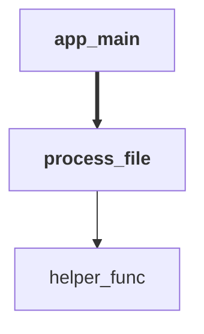
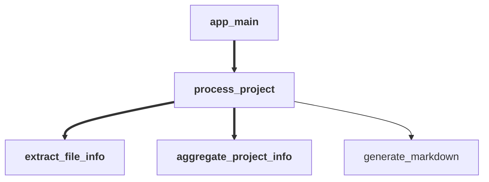

# Multi-Codebase Summarization (v1)

[](https://github.com/cocoindex-io/cocoindex)
We appreciate a star ⭐ at [CocoIndex Github](https://github.com/cocoindex-io/cocoindex) if this is helpful.

This example shows how to use [instructor](https://github.com/jxnl/instructor) with Gemini to analyze multiple Python codebases and generate markdown documentation using CocoIndex v1.

## What It Does

1. **Scans subdirectories** of a root directory (each expected to be a separate Python project)
2. **Per-file extraction** using LLM with a unified `CodebaseInfo` model:
   - Public classes and functions with functionality summaries
   - CocoIndex app call relationship graphs (Mermaid format)
   - File-level summaries
3. **Project aggregation** - combines file-level `CodebaseInfo` into a project-level summary
4. **Outputs markdown** documentation to `output/PROJECT_NAME.md`

## Key Features

- **Instructor Integration**: Uses instructor library for structured LLM outputs with Pydantic
- **Unified Data Model**: Same `CodebaseInfo` type for both file-level and project-level extraction
- **LLM-Generated Mermaid Graphs**: The LLM generates mermaid syntax directly with:
  - Bold text for `@coco.function` decorated functions
  - Thick arrows (`==>`) for `mount`/`mount_run` calls
- **Incremental Processing**: CocoIndex handles caching - only re-processes changed files
- **Multi-Project Support**: Processes multiple codebases in parallel

## Output Format

The generated markdown includes:

- **Overview** - High-level project description
- **Components** - Classes and functions with summaries
- **CocoIndex Pipeline** - Mermaid diagrams (if CocoIndex is used)
- **File Details** - Per-file summaries (for multi-file projects)

### Example Mermaid Graph



*Bold = `@coco.function`, thick arrows (`==>`) = `mount`/`mount_run` calls*

## Run

### 1. Install dependencies

```sh
pip install -e .
```

### 2. Set up environment variables

Create a `.env` file in the example directory:

```sh
echo "GEMINI_API_KEY=your_api_key_here" > .env
```

Replace `your_api_key_here` with your actual Gemini API key.

Optionally, set a different LLM model:

```sh
echo "LLM_MODEL=gemini/gemini-2.5-flash" >> .env
```

### 3. Prepare your projects

Create a `projects/` directory with subdirectories for each Python project:

```
projects/
├── my_project_1/
│   ├── main.py
│   └── utils.py
├── my_project_2/
│   └── app.py
└── ...
```

### 4. Run the application

```sh
cocoindex update main.py
```

This will:
1. Scan all subdirectories in `projects/`
2. Extract information from all `.py` files (excluding `.venv*` directories)
3. Generate markdown documentation in `output/`

### 5. Verify the output

```sh
ls -la output/
cat output/my_project_1.md
```

## Customization

### Change Input/Output Directories

Edit the `app` definition in `main.py`:

```python
app = coco.App(
    app_main,
    coco.AppConfig(name="MultiCodebaseSummarization"),
    root_dir=pathlib.Path("./your_projects_dir"),
    output_dir=pathlib.Path("./your_output_dir"),
)
```

### Use a Different LLM

Set the `LLM_MODEL` environment variable to any LiteLLM-supported model:

```sh
# OpenAI
export LLM_MODEL=gpt-4o

# Anthropic
export LLM_MODEL=anthropic/claude-3-5-sonnet

# Local (Ollama)
export LLM_MODEL=ollama/llama3.2
```

## How It Works



1. **app_main**: Lists subdirectories, sets up output target, mounts `process_project` for each
2. **process_project**: Extracts info from each file, aggregates, outputs markdown
3. **extract_file_info**: Uses instructor + LLM to extract `CodebaseInfo` from each file
4. **aggregate_project_info**: Combines file `CodebaseInfo` into project-level `CodebaseInfo`
5. **generate_markdown**: Converts `CodebaseInfo` to markdown and calls `declare_file`
