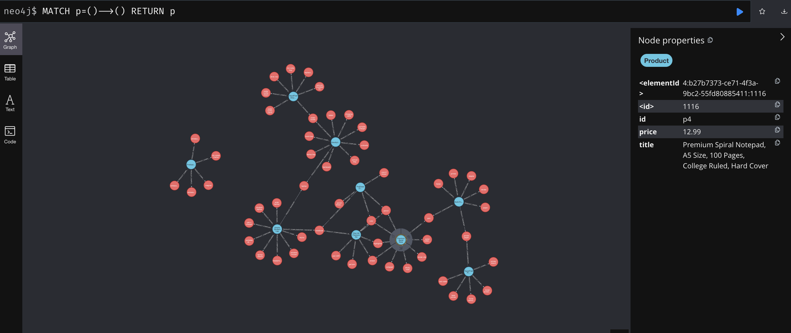

# Build Real-Time Recommendation Engine with LLM and Graph Database

We will build a real-time product recommendation engine with LLM and graph database. In particular, we will use LLM to understand the category (taxonomy) of a product. In addition, we will use LLM to enumerate the complementary products - users are likely to buy together with the current product (pencil and notebook). 

We will use Knowledge Graph to explore the relationships between products that can be further used for product recommendations or labeling.

Please drop [CocoIndex on Github](https://github.com/cocoindex-io/cocoindex) a star to support us and stay tuned for more updates. Thank you so much 🥥🤗. [](https://github.com/cocoindex-io/cocoindex)


## Prerequisite
*   [Install Postgres](https://cocoindex.io/docs/getting_started/installation#-install-postgres) if you don't have one.
*   [Install Neo4j](https://cocoindex.io/docs/ops/storages#neo4j) if you don't have one.
*   [Configure your OpenAI API key](https://cocoindex.io/docs/ai/llm#openai).

## Documentation
You can read the official CocoIndex Documentation for Property Graph Targets [here](https://cocoindex.io/docs/ops/storages#property-graph-targets).

## Run

### Build the index

Install dependencies:

```bash
pip install -e .
```

Setup:

```bash
python main.py cocoindex setup
```

Update index:

```bash
python main.py cocoindex update
```

### Browse the knowledge graph

After the knowledge graph is built, you can explore the knowledge graph you built in Neo4j Browser.

For the dev enviroment, you can connect neo4j browser using credentials:
- username: `neo4j`
- password: `cocoindex`
which is pre-configured in the our docker compose [config.yaml](https://raw.githubusercontent.com/cocoindex-io/cocoindex/refs/heads/main/dev/neo4j.yaml).

You can open it at [http://localhost:7474](http://localhost:7474), and run the following Cypher query to get all relationships:

```cypher
MATCH p=()-->() RETURN p
```


## CocoInsight 
I used CocoInsight (Free beta now) to troubleshoot the index generation and understand the data lineage of the pipeline. 
It just connects to your local CocoIndex server, with Zero pipeline data retention. Run following command to start CocoInsight:

```bash
python main.py cocoindex server -ci
```

And then open the url https://cocoindex.io/cocoinsight. 


